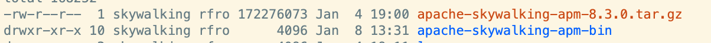
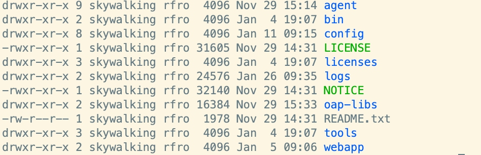
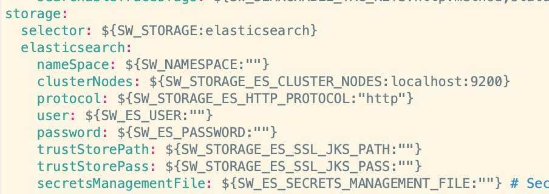
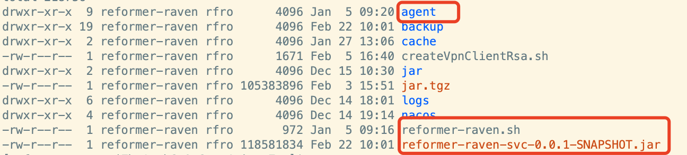

#### SKY_WALKING

##### 组件

- 1、skywalking服务端
- 2、为服务数据收集SDK
- 3、数据存储服务（此次使用ES）

##### 安装使用

* 安装ES

---

* 安装skywalking客户端

  版本： apache-skywalking-apm-8.3.0 
  
  
  修改配置： 解压后进入apache-skywalking-apm-bin/config，设置数据存储位置 
  

---

* copy apache-skywalking-apm-8.3.0下agent中的所有文件到服务同级目录下
  

配置修改: 进入agent/config目录，修改agent.config文件中修改应用名 agent.service_name=${SW_AGENT_NAME:你的应用名}

应用脚本修改:
> java -Xmx128m -Xms128m -Xss256k -jar $projectName> /dev/null 2>&1 & 
> 替换为 
> -java agent:agent/skywalking-agent.jar -Xmx128m -Xms128m -Xss256k -jar $projectName> /dev/null 2>&1  
